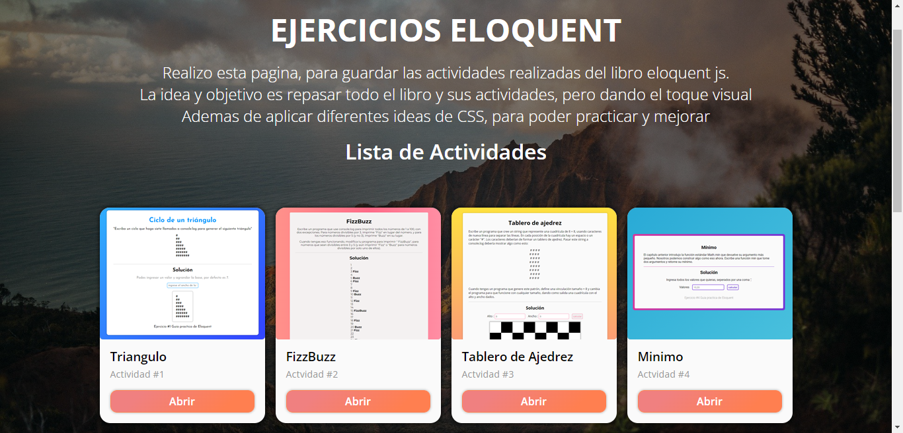

# Ejercicios Eloquent

### Desafio - Relizar los ejercicios del libro eloquent

  

Solucion de los problemas enunciados por el libro EloquentJS, con un toque de html y css
  
  

## Table of contents ✨

  
  

- [Vision General](#vision-general-📑)

  

- [Desafio](#desafio-🏅)

  

- [Links](#links-🔗)

  

- [Proceso](#proceso-🔨)

  

- [Proyecto](#proyecto-🌍)

  

- [Que aprendi](#que-aprendi-💡)

  

- [Recursos utiles](#recursos-utiles-🔔)

  

- [Autor](#autor-😎)

  

## Vision General 📑

  

### Desafio 🏅

  

El desafio, es repasar todos los ejercicios practicos, del libro, tomando entrada por usuario, procesando y devolviendo html, de manera que se puea apreciar visualmente.

  

### Links 🔗

  

- URL de la solucion: [Github](https://github.com/gabrielteresczuk/eloquent) 📌

  

- URL del Sitio en Vivo: [Demo](https://gabrielteresczuk.github.io/eloquent/) 👀

  

## Proceso 🔨

  

### Proyecto 🌍

 - Reafirmar conocimientos practicos y teoricos de JS
- Crear una pagina por cada ejercicio
- Dar un estilo a cada capitulo
- Dar un estilo a cada ejercicio
- Investigar sobre UX/UI 
  

### Que aprendi 💡

  
- Callstack
- Recursividad
- Cohercion de datos
- Diferencia entre rest parameter y spread operator
  

### Recursos Utiles 🔔

  

- [Eloquent](https://eloquentjavascript.net/) - Link del Libro.

  

- [Mdn Mozilla developer Network](https://developer.mozilla.org/es/docs/Web/CSS/CSS_Grid_Layout) - MDN es el sitio de documentacion STANDART.

  

## Autor 😎

  

- Portfolio - [Portfolio](https://gabrielteresczuk.github.io/portfolio2/)

- Linkedin - [in/gabriel-teresczuk](https://www.linkedin.com/in/gabriel-teresczuk/)